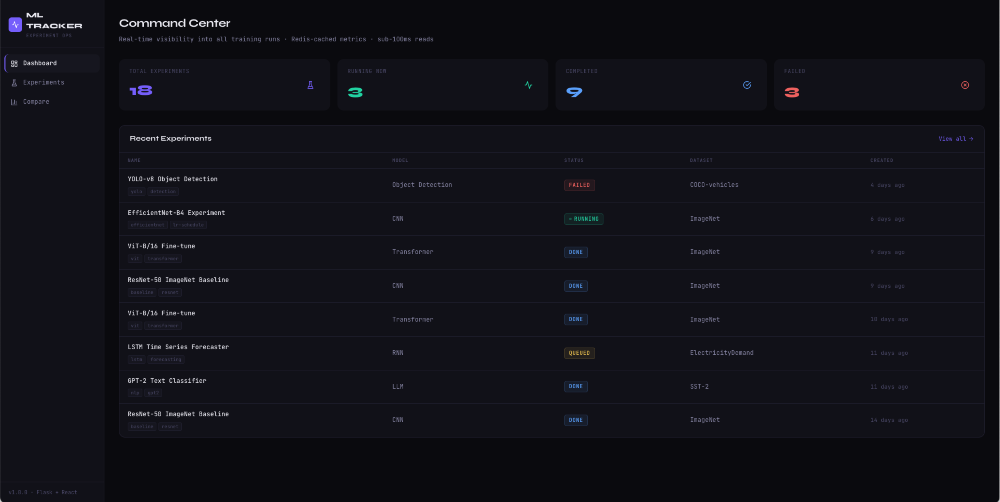

# ML Experiment Tracker



I built this after getting curious about how ML teams at large companies track hundreds of training runs at once. The problem is straightforward but the engineering behind it is interesting — you need fast reads because dashboards poll frequently, durable writes because you can't lose training data, and a clean way to log metrics from whatever training script someone is running. This is my take on solving that.

## What it does

You start a training run, point the Python client at the server, and call `tracker.log()` each epoch. The dashboard shows your runs in real time — loss curves, accuracy, learning rate, whatever you log. You can compare multiple runs side by side to see which hyperparameter changes actually helped.

The UI also shows whether each metric response came from Redis cache or hit Postgres directly, which I thought was a useful thing to surface.

## Tech stack

| | |
|---|---|
| Backend | Python, Flask, SQLAlchemy |
| Frontend | React 18, Recharts, React Query |
| Database | PostgreSQL 16 |
| Cache | Redis 7 |
| Infrastructure | Docker, Docker Compose |
| CI/CD | GitHub Actions |

## Architecture

```
React (Nginx)
     |
Flask REST API ──→ Redis  (30s TTL, hot metric reads)
     |
  PostgreSQL  (experiment metadata + full metric history)
```

The read pattern is what made Redis worth adding. The dashboard polls every 5 seconds for any running experiment. Without caching, that's a Postgres hit every 5 seconds per user. With a 30-second TTL, most of those are Redis hits instead. Cache gets invalidated on every metric write so the data stays fresh. Nothing exotic, but it works and the latency difference is measurable.

## Running it

You just need Docker installed.

```bash
git clone https://github.com/YOUR_USERNAME/ml-experiment-tracker
cd ml-experiment-tracker
docker compose up --build
```

Opens at http://localhost:3000. It seeds itself with a few sample experiments so the dashboard isn't empty on first load.

## Logging from a training script

```python
from ml_tracker_client import ExperimentTracker

tracker = ExperimentTracker(base_url="http://localhost:5000/api")
tracker.create_experiment(
    name="ResNet-50 baseline",
    model_type="CNN",
    dataset="ImageNet",
    hyperparameters={"lr": 0.001, "epochs": 90},
    tags=["resnet", "baseline"],
)
tracker.start()

for epoch in range(90):
    loss = train_one_epoch(model, loader)
    tracker.log({"train_loss": loss, "accuracy": val_acc}, step=epoch + 1)

tracker.complete(final_metrics={"accuracy": 0.762, "val_loss": 0.891})
```

There's also a demo script you can run to simulate a full training run:

```bash
pip install requests
python ml_tracker_client.py
```

## API

| Method | Endpoint | What it does |
|---|---|---|
| GET | `/api/health` | Health check — returns DB and Redis status |
| GET | `/api/experiments/` | List experiments, filterable by status |
| POST | `/api/experiments/` | Create a new experiment |
| GET | `/api/experiments/:id` | Get experiment detail (Redis-cached) |
| PATCH | `/api/experiments/:id` | Update status or final metrics |
| DELETE | `/api/experiments/:id` | Delete experiment |
| GET | `/api/experiments/summary` | Counts by status for the dashboard |
| GET | `/api/metrics/:id` | Full metric history grouped by name |
| POST | `/api/metrics/:id` | Log one or more metrics (batch supported) |
| GET | `/api/metrics/:id/latest` | Most recent value per metric |

## Tests

```bash
cd backend
pip install -r requirements.txt pytest
pytest tests/ -v
```

Backend tests use SQLite in memory so you don't need Postgres running locally.

## CI/CD

GitHub Actions runs on every push to main:

1. Backend tests
2. Frontend build check  
3. Docker image builds for both services
4. Integration test — spins up the full stack and confirms the health endpoint returns OK

## Project layout

```
ml-experiment-tracker/
├── backend/
│   ├── app/
│   │   ├── models/          SQLAlchemy models
│   │   ├── routes/          Flask blueprints (experiments, metrics, health)
│   │   └── services/        Redis cache layer
│   ├── tests/
│   └── Dockerfile
├── frontend/
│   ├── src/
│   │   ├── components/
│   │   ├── pages/
│   │   └── utils/
│   └── Dockerfile
├── .github/workflows/ci.yml
├── docker-compose.yml
└── ml_tracker_client.py
```
